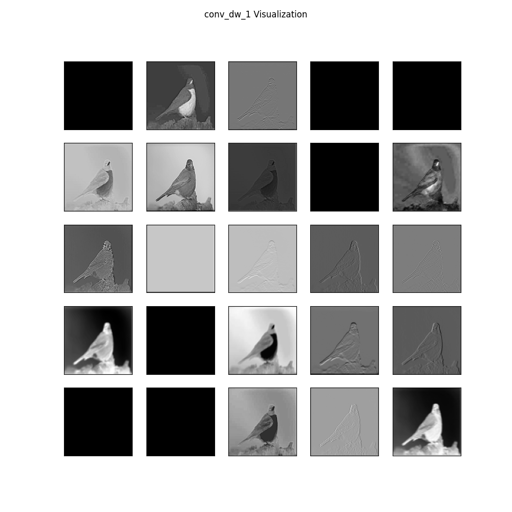
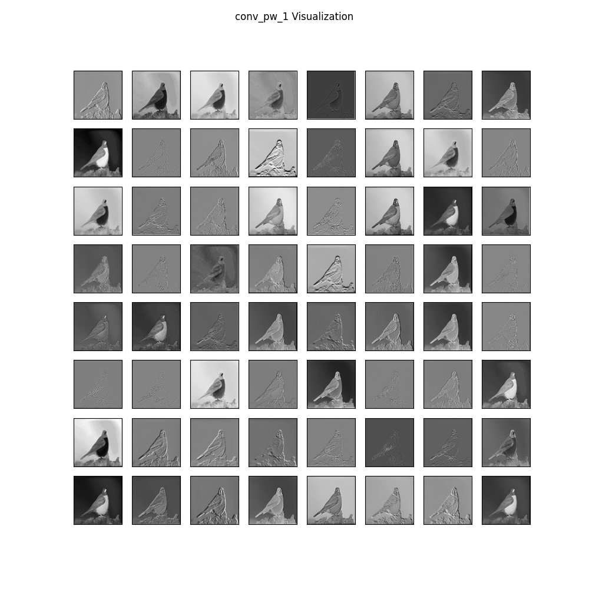

# MobileNet Feature Map Visualization
This is a Python repository that contains two files `Model.py` and `Visualize.py`.

`Model.py` defines a simple model class that uses MobileNet to extract feature maps from an input image. The `Simple_Model` class takes an image path as input and returns the feature maps for specific layers of the MobileNet model.

`Visualize.py` defines a class Visualize that takes the feature maps returned by `Simple_Model` and visualizes them. The script creates a grid of feature maps for each layer and saves them in the Images directory.
## MobileNet
MobileNet is a convolutional neural network architecture that is designed for mobile and embedded vision applications. The architecture is based on depthwise separable convolutions, which greatly reduces the number of parameters and computational cost while maintaining high accuracy.

In this code, we use the MobileNet model pre-trained on the ImageNet dataset to extract feature maps from an input image.

### Model.py
`Model.py` contains a class `Simple_Model` that uses the MobileNet model to extract feature maps from an input image. The class takes an image path as input and returns the feature maps for specific layers of the MobileNet model. The class has the following methods:

+ `__init__()`: Initializes the class with the MobileNet model and the output layers whose feature maps we want to extract.
+ `build_model()`: Builds a simple model that takes an input image and returns the feature maps for the specified layers.
+ `get_feature_map(img_path)`: Takes an image path as input, pre-processes the image, and returns the feature maps for the specified layers.

### Visualize.py
`Visualize.py` contains a class Visualize that takes the feature maps returned by `Simple_Model` and visualizes them. The script creates a grid of feature maps for each layer and saves them in the Images directory. The class has the following methods:

+ `__init__()`: Initializes the class with the default values for the layer number, layer type, and figure size.
+ `proccess_each_feature_map(square, fmap)`: Takes the feature maps for a single layer, creates a grid of feature maps, and saves the figure in the Images directory.
+ `show_each_feature_map(feature_maps)`: Takes the feature maps for all specified layers, processes each layer using `proccess_each_feature_map()`, and saves the figures in the Images directory.

## Requirements
To run the mobilenet_feature_map_visualization.py script, you will need the following:
```
tensorflow
keras
numpy
Pillow
matplotlib
```
You can install the required dependencies using pip:
```
pip install -r requirements.txt
```
## Usage
To use this code, you can follow these steps:

Clone the repository to your local machine:
```
git clone https://github.com/soheill2001/Visualize_MobileNet_Output_Layers.git
```
In the command line, navigate to the root directory of the repository and run the following command to visualize feature maps for a sample image:
```
python Visualize.py --image_path sample.jpg
```
This will generate feature map visualizations for the specified input image and save them in the Images directory.

**Note**: First you need to delete all files in Images folder if you want to use your own image.

## Output
The features extracted by each layer of MobileNet are determined by the filters learned during training and can be difficult to interpret directly.

+ conv_dw (depthwise convolutional layer): This layer applies a set of depthwise filters to the input image, which convolve with each input channel separately. The output of this layer typically includes edge and corner features, as well as simple texture features such as gradients and blobs.

+ conv_pw (pointwise convolutional layer): This layer applies a set of pointwise filters to the output of the previous layer, which convolve with the entire depth of the feature maps. The output of this layer combines and abstracts the features extracted by the previous layer to form more complex and abstract features.

You can find a total of 26 images in the `Images` folder, with 13 of them intended for conv_dw and the remaining 13 for conv_pw.

## Example
Here is an example of the feature maps generated for the input image `bird.jpg`:




Each subplot represents a feature map from a different layer of the MobileNet model. The subplots are arranged in a grid, with each row representing a different layer and each column representing a different feature map within that layer. The color of each pixel in the feature map corresponds to the strength of the activation of that feature in the input image.

## More Information
You can find more information about this project [here.]()
